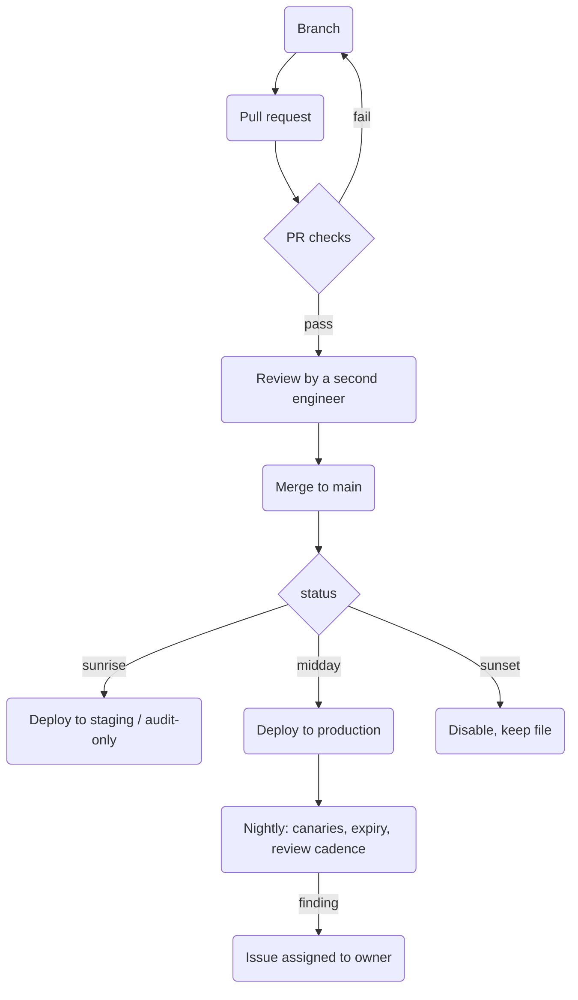

+++
title = "Pipeline example"
chapter = false
weight = 33
draft = false
+++

### What the pipeline is for

Detection as Code is only as real as the pipeline that enforces it. The repository holds the files, but the pipeline is what turns the schema into rules: a detection cannot reach production without passing the checks, a logic change cannot land without a second reviewer, and a `status` change is the only way to move between lifecycle phases.

This page shows one way to build that pipeline on GitHub. The pieces are GitHub Actions, branch protection, CODEOWNERS, and environments. Nothing here depends on a particular SIEM; the only vendor-specific code lives in one deploy script that the workflow calls.

### Repository layout

```text
detections/
  det-0001-okta-mfa-fatigue/
    detection.yml        # the machine-readable record (see The yaml file)
    README.md            # the human narrative and runbook
    tests/
      test_query.py      # unit tests for the logic
      true_positive.json # a replayable event that must fire
scripts/
  validate.py            # schema, ids, ATT&CK, data dictionary, exceptions
  deploy.py              # the only file that knows the SIEM API
  canary.py              # emits synthetic events and checks the alert arrived
schema/
  detection.schema.json
  data_dictionary.yml
.github/
  CODEOWNERS
  workflows/
    pr.yml               # runs on every pull request
    deploy.yml           # runs on merge to main
    nightly.yml          # exception expiry, review cadence, canaries
```

One directory per detection keeps the YAML, the narrative, and the tests together, so a pull request that changes one changes the others in the same diff.

### The flow



### Pull request checks

Everything that can be checked by a machine is checked here, before a human spends time reviewing.

```yaml
# .github/workflows/pr.yml
name: Detection PR checks

on:
  pull_request:
    paths:
      - "detections/**"
      - "schema/**"

jobs:
  validate:
    runs-on: ubuntu-latest
    steps:
      - uses: actions/checkout@v4
        with:
          fetch-depth: 0            # needed to diff against the base branch

      - uses: actions/setup-python@v5
        with:
          python-version: "3.12"

      - run: pip install -r requirements.txt

      - name: Which detections changed
        id: changed
        run: |
          echo "dirs=$(git diff --name-only origin/${{ github.base_ref }}... \
            | grep '^detections/' | cut -d/ -f1-2 | sort -u | tr '\n' ' ')" >> "$GITHUB_OUTPUT"

      - name: Schema and reference checks
        run: python scripts/validate.py ${{ steps.changed.outputs.dirs }}
        # validate.py checks, per The yaml file page:
        #   - file validates against schema/detection.schema.json
        #   - id is unique across the repo and unchanged in the diff
        #   - version increased if query, baseline, or data_sources changed
        #   - no exception is past its expires date
        #   - every data_sources.name exists in schema/data_dictionary.yml
        #   - every mitre.technique is a valid ATT&CK id
        #   - sunset_reason is set when status is sunset

      - name: Query syntax
        run: python scripts/deploy.py --dry-run ${{ steps.changed.outputs.dirs }}
        env:
          SIEM_TOKEN: ${{ secrets.SIEM_READONLY_TOKEN }}
        # dry-run compiles the query against the platform without saving it

      - name: Unit tests
        run: pytest ${{ steps.changed.outputs.dirs }}

      - name: True positive replay
        run: python scripts/canary.py --replay ${{ steps.changed.outputs.dirs }}
        env:
          SIEM_TOKEN: ${{ secrets.SIEM_STAGING_TOKEN }}
        # sends tests/true_positive.json to staging and asserts the query matches it
```

The checks that need a credential use a read-only or staging token. Production credentials never appear in the PR workflow, because a pull request can be opened by anyone with write access to the repository.

### Review

Branch protection on `main` makes the pipeline binding rather than advisory:

* Require a pull request before merging.
* Require the `validate` check to pass.
* Require one approving review, and dismiss stale approvals when new commits are pushed.
* Require review from code owners.

CODEOWNERS routes the review to the people who own the detection, and a catch-all keeps the detection engineering team on every change:

```text
# .github/CODEOWNERS
detections/**                       @org/detection-engineering
detections/det-0001-*/              @org/identity-team @org/detection-engineering
schema/**                           @org/detection-engineering
scripts/deploy.py                   @org/detection-engineering
```

A reviewer is looking for what the machine cannot see: whether the logic actually catches the technique, whether the baseline is hiding too much, whether the runbook would make sense at two in the morning. Checklist questions live in the pull request template, not in the reviewer's head.

### Deploy on merge

The `status` field decides where a merged detection goes. The workflow does not have a "deploy to prod" button; changing `status` to `midday` in a reviewed pull request is the button.

```yaml
# .github/workflows/deploy.yml
name: Deploy detections

on:
  push:
    branches: [main]
    paths:
      - "detections/**"

concurrency: deploy-detections      # one deploy at a time, in order

jobs:
  plan:
    runs-on: ubuntu-latest
    outputs:
      sunrise: ${{ steps.plan.outputs.sunrise }}
      midday: ${{ steps.plan.outputs.midday }}
      sunset: ${{ steps.plan.outputs.sunset }}
    steps:
      - uses: actions/checkout@v4
        with:
          fetch-depth: 2
      - uses: actions/setup-python@v5
        with:
          python-version: "3.12"
      - run: pip install -r requirements.txt
      - name: Group changed detections by status
        id: plan
        run: python scripts/deploy.py --plan HEAD~1 HEAD >> "$GITHUB_OUTPUT"
        # emits: sunrise=det-0007 det-0012  midday=det-0001  sunset=det-0003

  staging:
    needs: plan
    if: needs.plan.outputs.sunrise != ''
    runs-on: ubuntu-latest
    environment: staging
    steps:
      - uses: actions/checkout@v4
      - run: python scripts/deploy.py --target staging ${{ needs.plan.outputs.sunrise }}
        env:
          SIEM_TOKEN: ${{ secrets.SIEM_STAGING_TOKEN }}

  production:
    needs: plan
    if: needs.plan.outputs.midday != ''
    runs-on: ubuntu-latest
    environment: production         # holds the prod secret; can require approvers
    steps:
      - uses: actions/checkout@v4
      - run: python scripts/deploy.py --target production ${{ needs.plan.outputs.midday }}
        env:
          SIEM_TOKEN: ${{ secrets.SIEM_PROD_TOKEN }}

  disable:
    needs: plan
    if: needs.plan.outputs.sunset != ''
    runs-on: ubuntu-latest
    environment: production
    steps:
      - uses: actions/checkout@v4
      - run: python scripts/deploy.py --disable ${{ needs.plan.outputs.sunset }}
        env:
          SIEM_TOKEN: ${{ secrets.SIEM_PROD_TOKEN }}
      - name: Tell the responders
        run: python scripts/notify.py --sunset ${{ needs.plan.outputs.sunset }}
```

The production environment is where the production token lives. GitHub environments can also require a named approver before the job runs, which is a reasonable control early on and becomes a bottleneck later. Most teams start with it and remove it once the PR checks have earned trust.

The deploy script is idempotent: it reads the YAML, renders it to whatever the platform expects, and creates or updates the rule keyed on `id`. Running it twice on the same commit changes nothing. That property is what makes rollback a revert.

### The nightly job

Midday is where most of the lifecycle happens, and it happens on a schedule rather than on a commit.

```yaml
# .github/workflows/nightly.yml
name: Detection health

on:
  schedule:
    - cron: "0 6 * * *"
  workflow_dispatch:

jobs:
  health:
    runs-on: ubuntu-latest
    environment: production
    steps:
      - uses: actions/checkout@v4
      - uses: actions/setup-python@v5
        with:
          python-version: "3.12"
      - run: pip install -r requirements.txt

      - name: Canaries
        run: python scripts/canary.py --all-midday
        env:
          SIEM_TOKEN: ${{ secrets.SIEM_PROD_TOKEN }}
        # emits a synthetic event per midday detection with a canary block
        # and fails the detection if no alert arrives within its window

      - name: Drift
        run: python scripts/validate.py --drift
        env:
          SIEM_TOKEN: ${{ secrets.SIEM_PROD_TOKEN }}
        # for each data_sources entry: is the source still arriving,
        # are the listed fields still populated

      - name: Expiry and cadence
        run: python scripts/validate.py --expiry --cadence
        # exceptions past expires, detections past review_cadence_days

      - name: Open issues for findings
        if: failure()
        run: python scripts/notify.py --issues
        env:
          GH_TOKEN: ${{ github.token }}
        # one issue per detection, assigned to the owner, labelled with the finding
```

A finding becomes a GitHub issue assigned to the owner from the YAML file, which gives the Midday Health function a queue with a name on every item. An expired exception is removed by a pull request that deletes it; a stale review is closed by a pull request that updates `last_reviewed_date`. Both go through the same checks as everything else.

### What this gives you

* **The lifecycle is enforced, not described.** A detection cannot be in production without `status: midday`, and `status: midday` cannot be set without a reviewed pull request.
* **Rollback is a revert.** Every production rule corresponds to a commit on `main`.
* **The vendor surface is one file.** Swapping platforms means rewriting `deploy.py` and the query dialect, not the process.
* **Ownership has a mechanism.** The nightly job turns the `owner` field into assigned issues.

### Where to adapt

* **Monorepo versus one repo per platform.** One repository with a `platform` field is simpler until two platforms need different test tooling.
* **Deploy on merge versus deploy on tag.** Merge-triggered deploys are the default here. Tag-triggered deploys suit teams that batch changes or need a change-management record per release.
* **Who can set midday.** A separate CODEOWNERS rule can require the detection engineering team on any diff that touches the `status` line, if the responding teams own detections but should not promote them alone.
