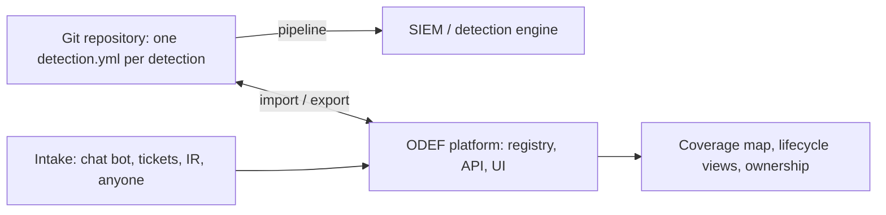

+++
title = "Reference platform"
chapter = false
weight = 34
draft = false
+++

### A proposed open source platform

The YAML schema and the pipeline are enough to run Detection as Code with nothing but a Git repository and a CI runner. What they do not give you is a place to look: a registry where anyone in the company can see what is detected, by whom, in what state, and where the gaps are. That is the piece most teams end up building for themselves.

ODEF has a reference implementation of that piece, started in 2024 and paused, which we are proposing to resume as the open source platform for the framework: **[0xd3f/odef-platform on GitHub](https://github.com/0xd3f/odef-platform)**, MIT licensed.

### Where it sits

The repository stays the source of truth and the pipeline stays the only path to production. The platform is the registry on top: it imports the YAML, exposes it through an API and a UI, and gives the Detection Strategy layer its inputs. It is not a second place to edit logic. A change made in the platform is exported back to the repository as a file and goes through the same pull request as everything else.

### What exists today

The paused codebase is a Python application on Flask-AppBuilder with PostgreSQL. It runs in a dev container, optionally alongside a Splunk instance for testing queries.

* **Detection registry.** One record per detection with name, description, query, data source, baseline, schedule, MITRE id, and relationships to detection type, product type, ATT&CK tactic, and lifecycle status. Status is seeded with Sunrise, Midday, and Sunset.
* **Import and export.** Detections import from YAML or JSON files, with insert-or-update keyed on id and a confirmation step. Selected detections export to YAML or JSON, which is the hand-off to the repository.
* **REST API with Swagger UI.** CRUD endpoints for every model, so the pipeline and other tools can read the registry without the UI.
* **Role-based access.** Authentication, users, and permissions come from Flask-AppBuilder, with a read-only reporting view for people outside the team.
* **Database migrations, seed data, linting in CI, and a translation scaffold.**

### Gap between the code and the framework

The platform was written against the 2024 version of the YAML template, which is far smaller than the [reference schema]({}) on this branch. Resuming it means closing that gap, which is also the roadmap:

| Area | Today | To match the framework |
|---|---|---|
| Identity | integer id, name | stable `det-` id, `version`, `type` (indicator, behavioural, correlation, anomaly, hunt) |
| Ownership | author only | `owner` distinct from author, review cadence, last reviewed date |
| Origin | none | `origin` (intake, incident, threat intel, coverage gap, hunt) and references |
| Coverage | one tactic, one MITRE id | many techniques per detection with confidence, which is what a coverage map needs |
| Data | free-text source | data sources with fields, validated against a data dictionary |
| Exceptions | none | owned, justified, expiring suppressions, separate from baseline |
| Alert design | none | severity, priority, payload fields, runbook, expected volume |
| Tests | none | unit, true positive, canary definitions |
| Deployers | empty package | export to the repository and open a pull request; the pipeline does the rest |
| Health | none | read canary, drift, and exception findings from the nightly job and show them per owner |
| Intake | none | an intake queue that any source can write to through the API, triaged into the backlog |

The first milestone is the schema: migrate the model to the reference YAML so import and export are lossless. Everything else builds on that.

### Design constraints for the resumed project

* **Registry, not engine.** The platform never talks to the SIEM. The pipeline does. This keeps the platform vendor-neutral and keeps production credentials out of a web application.
* **Files win.** If the registry and the repository disagree, the repository is right and the registry re-imports. There is no state that lives only in the database.
* **API first.** Every UI action is an API call, so the chat bot, the ticket board, and the pipeline are all clients of the same thing.
* **Small enough to run on a laptop.** One container, one database, one command.

### How to contribute

The repository is being reopened alongside this branch of the wiki. Issues tracking the roadmap above will be opened there. If you run a version of this in your own environment and have a schema, a deployer, or an intake source to share, that is the contribution the project needs most.
